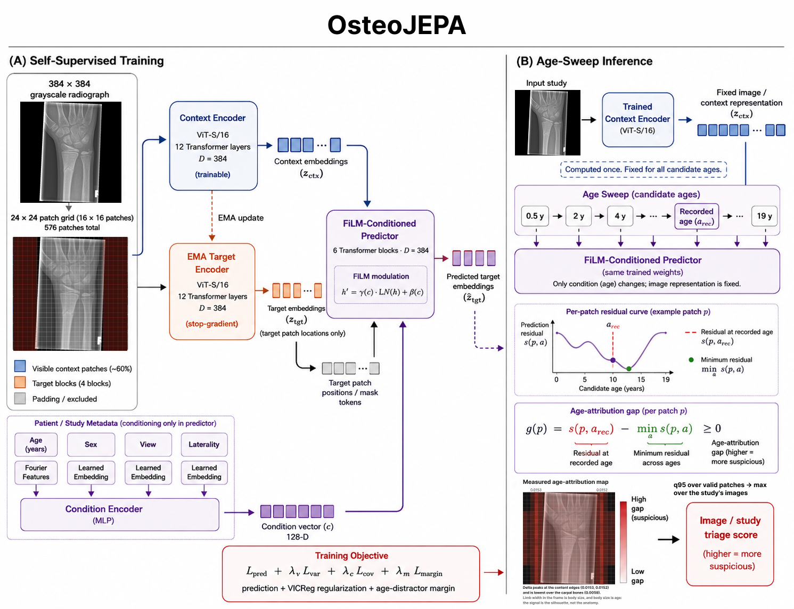

<div align="center">

# OsteoJEPA

### Fracture triage for pediatric wrist radiographs, where "normal" is a function of the child's age rather than a single class.



[](https://www.python.org/)
[](https://pytorch.org/)
[](https://fastapi.tiangolo.com/)
[](https://modal.com/)
[](https://figshare.com/articles/dataset/GRAZPEDWRI-DX/14825193)
[](LICENSE)

Pediatric wrist radiographs are hard to read because normal anatomy moves with age. A growth plate looks like a fracture line, and where it sits changes from one year to the next. OsteoJEPA was the proposed answer: condition a joint-embedding predictive architecture on age inside the predictor rather than the encoder, sweep candidate ages at inference, and score each patch by how much the freedom to pick an age helps explain what is there. Normal anatomy that looks unusual should have some other age that explains it. A fracture should have none. The idea did not work, and most of this repository is the record of finding that out honestly: the predictor never beat a constant baseline, and the signal it did produce sat on the outline of the limb rather than on bone. What ships instead is a supervised ViT-S/16 classifier at study AUROC 0.9580, temperature-calibrated to ECE 0.0416, alongside a Faster R-CNN detector at mAP@50 0.8298, served behind a FastAPI endpoint that orders a radiologist's reading queue and shows the on-call physician nothing before they decide.

</div>

## What this is, as a product

Physis reorders the queue a radiologist reads in the morning. It does not diagnose. The on-call physician who treats the child overnight never sees a model output, and has no account that could show them one.

That separation is a regulatory position, not a design preference. The claim follows computer-aided triage and notification (21 CFR 892.2080), which permits prioritizing a worklist but not marking locations on the original image for the treating clinician. What enforces it is the role model rather than an API flag: the application has accounts for radiologists and administrators and none at all for the on-call physician, so there is no screen for a box to reach.

When the service is down, the worklist reverts to arrival order. Nothing in the clinical workflow is allowed to depend on this system being up.

## Methodology

Two model families live in this repository, and only one of them works. Both are documented, because the one that failed is where the interesting result is.

### What was proposed: OsteoJEPA

An I-JEPA variant where the age enters through FiLM conditioning in the predictor, never in the encoder. Keeping age out of the encoder is what makes it something you can intervene on: at inference the same patch embedding can be re-predicted under a sweep of candidate ages, and the representation itself does not shift underneath the sweep.

For a patch `p` with recorded age `a_rec`, the score is the age-attribution gap:

```
Δ(p) = s(p, a_rec) - min over a of s(p, a)
```

A normal growth plate that reads as odd for a fourteen-year-old should look ordinary at nine, so its minimum over ages drops far below its score at the recorded age and Δ is large. A fracture has no age that explains it, so Δ stays near zero. Training uses only clean images with no fracture labels, which is why the approach was attractive: moving it to a new hospital would need images every hospital already has.

Stage A trained for 300 epochs on 3,382 clean training-fold images. VICReg variance and covariance terms on the context encoder output, an EMA target encoder, and a symmetric distractor margin loss on the predictor.

### Why it failed, and how we know

Three probes, one conclusion. The diagnostic that settled it is a skill ratio:

```
pred_skill_ratio = L_pred / mean_prediction_baseline
```

The per-dimension variance of the target tokens is exactly the loss a constant predictor achieves. Dividing by it asks a question the training loss cannot: is predicting better than not predicting?

| 20-epoch probe | skill at epoch 1 | at epoch 19 |
|---|---|---|
| baseline | 0.994 | **1.000** |
| variance weight 25 lowered to 1 | 0.985 | **1.003** |
| one-ring border erosion | 0.988 | **0.998** |

It never dropped below 1.0 in any configuration. `L_pred` and the baseline fell together to three decimal places, which means what decreased during training was the variance of the target, not the error of the prediction. VICReg pins every dimension of `z` to unit variance, so a predictor that ignores its input entirely and emits the mean scores about 1.0 and has no gradient pressure to do better.

The spatial map says the same thing from the other side. Δ concentrates in two vertical stripes at the content edges (about 0.016) and is lowest in the centre where the carpal bones are (about 0.005). Eight qualitative crops drawn from the developmental-variant group show soft-tissue boundaries, content edges, and letter markers. Not one growth plate. This is the aspect-ratio leak the design anticipated: the limb's silhouette tracks body size, body size tracks age. Excluding padding patches is necessary and it is not sufficient, because the valid patches immediately beside the padding still carry the outer edge of the arm.

Downstream confirmation closes it. A classifier initialized from the Stage A checkpoint reaches study AUROC 0.7453 against 0.9580 from plain ImageNet weights. Stage A did not merely fail to learn something new. It degraded the representation it started from by 0.21 AUROC.

### The methodological finding

Both pre-registered abort criteria passed for 300 epochs while the prediction task was never learned. `Var(z)` did not collapse. Median `V(p)` rose. Neither criterion is dishonest, and neither one measures whether prediction beats non-prediction. The skill ratio caught it in a single epoch of a 20-epoch probe. Anti-collapse monitoring is not sufficient supervision for a joint-embedding predictive architecture, and that is worth more to a reader than the result the architecture was supposed to produce.

### What ships: the supervised classifier

| Component | Choice |
|---|---|
| Backbone | ViT-S/16, ImageNet initialized, 21.61M parameters |
| Input | 384x384 16-bit grayscale, 576 patches of 16x16 |
| Pooling | masked mean over valid patches only, padding excluded |
| Conditioning | age, sex, projection, laterality as a learned condition vector |
| Target | `n_fracture_box > 0` |
| Loss | binary cross-entropy |
| Training | 12,195 training-fold images, 15 epochs, AdamW at 1e-4 |

The `patch_embed` weights are summed across the three ImageNet input channels rather than sliced to one, which preserves 7839.7 units of filter energy against 3338.4 for the sliced version, and the position embedding is bicubic-interpolated from 14x14 to 24x24.

Padding never enters anything. It is excluded in mask sampling, in pooling, in the age sweep, and in every statistic, and each of those exclusions is asserted rather than assumed.

### Calibration, and the percentile a radiologist actually reads

A raw score is not actionable. "94th percentile for a fourteen-year-old" is. Getting there takes two steps, and the second one is where the interesting bug was.

Temperature scaling on the validation fold, in the sense of Guo et al.:

| | Before | After |
|---|---|---|
| Temperature | | **3.300** |
| ECE, validation | 0.0731 | 0.0394 |
| ECE, test | 0.0924 | **0.0416** |
| Probabilities inside (0.01, 0.99) | 3.5% | 100% |

AUROC is unchanged to 1e-9, as any monotone transform requires.

Then the percentile, computed against clean validation cases in the same age band. The reference has to be built at the level it will be queried at. The worklist ranks studies using the maximum over a study's images, and the maximum of about 1.8 draws is stochastically larger than a single draw:

| Reference built from | Median percentile of a clean test study | Above the 90th |
|---|---|---|
| clean validation images | 0.720 | **24.0%** |
| clean validation studies | 0.580 | 16.5% |

A quarter of entirely normal studies reading as near-urgent is a worklist defect, not a rounding error. The service uses the study-level reference.

One more defect worth naming, because it is invisible to the metric that is supposed to catch it. The training run saved sigmoid outputs, and float32 has no resolution left near 1.0, so 428 flagged studies shared 65 distinct values. Rescoring from the logit gives 427 distinct values. The AUROC difference was 0.000003, because AUROC scores ties at half credit and therefore barely registers a worklist that cannot order the cases it flags.

### The box detector

Faster R-CNN with a ResNet50-FPN v2 backbone, COCO-initialized, one class. Not YOLO: ultralytics is AGPL-3.0 against this project's MIT licence, and its 8-bit decode path would throw away the 16-bit depth that every other boundary here asserts on.

The original plan was to fine-tune the detector from the Stage A backbone. Stage A cost a classifier 0.21 AUROC as an initializer, so COCO weights were used instead and the substitution is stated rather than made quietly.

The detector costs about a second per image on CPU against the classifier's 79 ms, so it is a separate pass the scorer can be asked to skip. The triage score stays with the calibrated classifier either way, so adding a detector changed no measurement that was already reported.

### How everything is evaluated

One protocol throughout, fixed before any model ran. GroupKFold on `patient_id` at seed 1337, fold 0 test, fold 1 val, folds 2 to 4 train. Every reported number is the test fold. Every threshold, the temperature, and the percentile reference come from validation only and are never refitted on test.

Patient-level grouping is the point rather than a detail. Splitting this dataset per image, as the published baselines on it do, puts the same child's left and right wrist on both sides of the split. That criticism is this project's own, so it was measured rather than asserted, on both model families and in both of their metrics.

One seed throughout. The compute budget did not allow repeats, so no variance across initializations was measured and none should be implied.

Four experiments are defined against this protocol. E1 asks whether the age-attribution gap separates fractures from developmental variation. E2 splits in two: whether age conditioning helps a model that already works, and whether the model learns a trajectory or memorizes discrete age points, tested by removing bands 9, 10 and 11 from training and evaluating on exactly those bands. E3 asks whether queue ordering saves a measurable number of hours, what a new site would need to recalibrate, and what serving costs end to end. E4 goes looking for the ways the model could be right for the wrong reason: plaster cast and surgical metal as shortcuts, and occult fractures that carry an AO classification but no box.

Results, with the file each number came from, are in the accompanying paper.

## Dataset

GRAZPEDWRI-DX (Nagy et al., 2022). 20,327 pediatric wrist radiographs from 6,091 patients, collected at University Hospital Graz between 2008 and 2018, de-identified, released CC0 Public Domain. The dataset ships two independent annotation layers and both are used here: nine box classes including `fracture` and `metal`, and image-level tags in `dataset.csv` including AO classification and plaster cast. Cast is not a box class, so E4a is only possible because of the CSV layer.

Preprocessing happens once, in `notebook/preprocessing-dataset.ipynb`, and produces the archives the training code reads. Per image: resize the long side to 384 preserving aspect ratio, clip intensity at the 1st and 99th percentile computed **before** padding, scale to [0, 1], then pad symmetrically with zeros to a 384x384 canvas. Percentiles must be computed before padding or the zeros contaminate them. Mean padding fraction is 0.431, so roughly 248 of the 576 tokens in each image are empty and must be masked out everywhere.

The archives are hosted on Hugging Face rather than in git, because the image zips are about 1.4 GB each. Put them in `dataset/` and let the setup script extract them:

```
data/
├── manifest.csv          20,327 rows, one per image
├── fracture_boxes.csv    18,090 boxes mapped into 384-space
├── age_band_counts.csv   clean images per age band per split
├── summary.json          every preprocessing parameter and headline number
└── images_384/           20,327 preprocessed 16-bit PNGs
```

The split is GroupKFold on `patient_id` at seed 1337: fold 0 test, fold 1 val, folds 2 to 4 train.

| Split | Images | Studies |
|---|---|---|
| train | 12,195 | |
| val | 4,066 | |
| test | 4,066 | 2,139 |

Zero patients and zero studies appear in more than one split, and both facts are asserted on every load rather than printed, because a warning that scrolls past the top of a terminal is not a guarantee.

Two geometry figures get confused easily and both are correct. Mean pixel content fraction is 0.5694. Mean valid patch fraction is 0.5306, lower because the whole-box rule drops any 16x16 patch that is only partly covered by real image. The patch figure is the one to report, since it is what the model sees.

## How to run

### Setup

```bash
bash scripts/setup_env.sh          # CUDA 12.8 build, for RTX 5080 / 5090
```

```bash
bash scripts/setup_env.sh --cpu    # CPU build, enough to serve and to run the tests
```

This creates `.venv`, installs pinned dependencies, extracts whatever archives are sitting in `dataset/`, and runs the test suite. torch 2.7 or newer is required on Blackwell cards, since older builds have no sm_120 kernels and fail at the first matmul rather than at import.

Verify the data before spending anything on a GPU:

```bash
.venv/bin/python scripts/check_data.py --config configs/base.yaml
```

That checks split integrity, geometry reconstruction, and patch labels. It is fast and it has caught real problems.

### Training on Modal

Training ran on Modal, one A100-40GB with 8 vCPU. `modal_app.py` defines every job, and the data lives on a Modal volume so a recalibration is a file write rather than an image rebuild.

```bash
modal run modal_app.py::extract_data
```

```bash
modal run modal_app.py::smoke
```

The smoke job runs the whole pipeline on a two-layer model before any GPU-hour is committed to a real run. After that, the jobs that produced the shipped artifacts:

```bash
modal run --detach modal_app.py::train_classifier --name clf_main
```

```bash
modal run modal_app.py::score_classifier --name clf_main
```

```bash
modal run --detach modal_app.py::train_detector --name det_main
```

`score_classifier` is a separate pass rather than part of training because the training loop saved sigmoid outputs, which have no float32 resolution near 1.0. Rescoring keeps the logit.

Stage A, the OsteoJEPA pretraining that produced the null, is still here and still runs:

```bash
modal run --detach modal_app.py::pretrain --name base
```

24 hours is Modal's ceiling for a single call. A longer run does not need a bigger timeout, it needs to be called again with `--resume`, which continues into the same run directory and the same `metrics.json` so the loss curve stays in one piece.

### Everything that does not need a GPU

Calibration, the confounder analysis, the queue simulation, and the latency measurement all run on a laptop:

```bash
.venv/bin/python scripts/calibrate_classifier.py --val-scores runs/clf_main/rescored/scores_val.csv --test-scores runs/clf_main/rescored/scores_test.csv
```

```bash
.venv/bin/python scripts/eval_confounders.py --scores runs/clf_main/rescored/scores_test.csv
```

```bash
.venv/bin/python scripts/simulate_queue.py --scores runs/clf_main/rescored/scores_test.csv --val-scores runs/clf_main/rescored/scores_val.csv
```

```bash
.venv/bin/python scripts/measure_latency.py --checkpoint artifacts/clf/clf_main/best.pt --calibration artifacts/clf/clf_main/classifier_calibration.json
```

### Tests

```bash
.venv/bin/python -m pytest -q
```

## The inference service

The web application lives in a separate repository and talks to this one over HTTP. The service owns every model rule: preprocessing, the padding mask, the age bands, the calibration. The client owns every product rule. A second implementation of preprocessing would be a second place for it to go wrong, so the client never resizes, pads, normalizes, or picks a band.

Locally, with no GPU and no cloud account:

```bash
.venv/bin/python scripts/serve_local.py
```

Paths default to `artifacts/`, so the fallback is one command rather than three paths typed correctly under pressure. Interactive docs land at `/docs`.

On Modal, the same FastAPI application behind a public URL that scales to zero between requests:

```bash
modal deploy modal_app.py
```

| Endpoint | Purpose |
|---|---|
| `GET /` | service information |
| `GET /v1/health` | liveness, public and thin |
| `POST /v1/predict` | inference, bearer authenticated |

One inference route, not three. Earlier versions also served `/v1/score/study`
and `/v1/score/image` onto the same scorer, which meant a second public request
shape built around object keys and integer view codes for no client that
existed. Types are Pydantic models, so `/openapi.json` is generated from the
same definitions the runtime enforces and the two cannot drift.

The service fetches presigned image URLs, which keeps bucket credentials out of
it. Fetching a URL a caller supplies is also an SSRF surface, so the fetch
refuses plain http, any host outside `PHYSIS_IMAGE_HOSTS`, any hostname
resolving to a loopback, private or link-local address, and any redirect.

A study is scored as the maximum over its images, because a wrist examination is normally a posteroanterior and a lateral projection and one suspicious projection is enough to raise a case. Scoring images in isolation cannot produce a queue.

`age_years` is the one field with no fallback. Age selects the normalization band, and defaulting it would silently score a child against the wrong population. Every other categorical field has a trained `unknown` embedding.

Exercise it against real test-fold studies, which the script selects deliberately so that positives carry no cast and negatives come from the strictly clean set:

```bash
.venv/bin/python scripts/try_service.py
```

## Repository layout

```
src/physis/
├── data/        manifest loading, splits, masking, geometry, patch labels
├── models/      ViT, FiLM predictor, condition encoder, classifier, detector
├── losses/      JEPA prediction, VICReg, margin, and the combined objective
├── scoring/     age sweep, aggregation, calibration
├── eval/        metrics and figures
├── serve/       preprocessing, scorer, FastAPI app, web-client compatibility
└── utils/       config and run directories

scripts/         one entry point per job, all argparse, all config-driven
configs/         base.yaml plus one file per experiment, deep-merged
tests/           124 tests
modal_app.py     every Modal job, including the deployed web endpoint
notebook/        the one-time dataset preprocessing notebook
```

Run outputs go to `runs/`, and anything promoted to a reported number is copied into `artifacts/`, which is treated as read-only provenance. Both are gitignored, as are the internal specification documents and the full results file, so every measurement quoted here is traceable to a checkpoint but the raw tables live with the paper rather than in the repository.

## Limitations

OsteoJEPA's null is the substantive limitation and it is described in full under Methodology. These are the practical ones, which a reader deciding whether to trust a score needs separately.

The cast shortcut is the most serious. A casted follow-up radiograph with no new fracture will reach the top of the worklist with maximum confidence, and on casted images generally the model is at chance. Anyone demonstrating this system should not use a casted study as the normal example, and anyone deploying it needs a cast detector in front of the triage score or an explicit exclusion rule.

Absence of a box is not evidence of absence of a fracture. mAP for small boxes is 0.3708 against 0.8298 overall, and subtle buckle fractures are both the hardest for the detector and among the most commonly missed by human readers. No interface built on this should say "no fracture detected" or show a green tick.

With a single seed and no repeats, differences of roughly one AUROC point should be read as ties rather than as an ordering.

The queue hours are simulated. They follow from an arrival process and an assumptions table the script prints, not from a hospital. Prevalence dominates the result, and the dataset's own 68.2% is the least representative point on the sweep.

Performance falls with patient age, by 6.5 AUROC points between the best and worst bands, and the oldest bands have the fewest positives to learn from. A deployment serving mostly adolescents would see the 0.9073 figure, not the 0.9580 one.

Recalibration at a new site does not converge with sample size. Collecting more normal images will not stabilise the reference threshold, so a new hospital needs a different approach than the obvious one.

Evaluation is a single curated cohort from one hospital between 2008 and 2018, on a fixed 384x384 preprocessing pipeline. There is no external validation, no comparison against a radiologist, and no test of what happens to images from a different scanner or a different preprocessing path.

## Acknowledgements

GRAZPEDWRI-DX was collected and released by Nagy et al. (2022) at the Medical University of Graz under CC0. The dataset's two annotation layers, and particularly the image-level cast tag, are what made the confounder analysis possible at all.

The architecture follows I-JEPA (Assran et al., 2023) with FiLM conditioning (Perez et al., 2018) placed in the predictor. The anti-collapse terms are VICReg (Bardes et al., 2022). Temperature scaling and the expected calibration error follow Guo et al. (2017). The hidden-stratification framing comes from Oakden-Rayner et al. (2020), and the shortcut-learning result replicates the pattern Zech et al. (2018) found with chest tubes on a different anatomy and a different confounder. The detector is torchvision's Faster R-CNN ResNet50-FPN v2, following Ren et al. (2015).

Built with PyTorch, timm, torchmetrics with the faster-coco-eval backend, FastAPI, and Modal. Developed for Datathon 2026, RISTEK Fasilkom UI.

## License

MIT. See [LICENSE](LICENSE) for the full text.

The dataset is CC0 and separately licensed. The detector is torchvision's implementation under BSD, which is why it was chosen over an ultralytics YOLO under AGPL-3.0.
